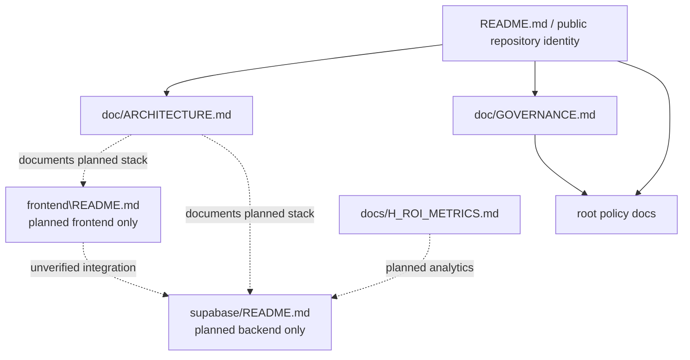

# Technical Architecture Audit

## Executive finding

The repository contains **documented architecture only**. No verified frontend application, backend configuration, database migration set, test suite, deployment manifest, or runtime integration exists in the tracked tree.

## Architecture diagram

## Direct answers to required architecture questions

1. **Is the frontend React, Vite, Next.js, another framework, or incomplete?**  
   Documented as **Lovable + React + Node.js**, but the actual frontend is incomplete and unimplemented. (Evidence: `frontend\README.md:17-21`; `doc/ARCHITECTURE.md:20-36`)

2. **Where is the application root?**  
   No application root exists. There is no real `frontend/` directory, no root app, and no package manifest.

3. **Does `frontend/` contain the real application or only documentation?**  
   No `frontend/` directory exists. A file named `frontend\README.md` exists instead. (Evidence: repository listing; `frontend\README.md:1-29`)

4. **Is there a root application?**  
   No.

5. **Are there multiple package manifests?**  
   No package manifests were found.

6. **What package manager is used?**  
   None is verified in-repo. `.gitignore` contains generic Node package-manager patterns, but no manifest or lockfile establishes an active choice. (Evidence: `.gitignore:40-144`)

7. **Is npm the current intended package manager?**  
   Unverified. `npm` is installed in the environment, but the repository does not declare npm usage.

8. **Does Supabase contain migrations, seed files, edge functions, configuration, RLS policies, authentication assumptions, or storage policies?**  
   No implementation artifacts were found. Only descriptive README files exist. (Evidence: `supabase/README.md:1-17`; `supabase/docs/README.md:1-13`)

9. **Are the frontend and Supabase layers connected?**  
   Only conceptually in documentation, not in tracked code.

10. **Are deployment files present?**  
    No.

11. **Is there any production URL?**  
    No production URL was found.

12. **Which capabilities are real versus documented only?**  
    Real: repository-level documentation and policy drafts. Documented only: frontend, backend, auth, RLS, storage, analytics, steward tooling, and workflows.

## Confirmed runtime components

- None.

## Unverified runtime components

- Lovable/React frontend
- Supabase project and schema
- auth flows
- RLS policies
- storage buckets
- H-ROI analytics
- workflow automation

## Application entry points

- None verified.

## Data flow

- No executable data flow could be validated.
- Intended data flow appears to be `public frontend -> Supabase auth/data/storage -> governance/metrics/policy outputs`, but that is only inferred from documentation.

## Trust boundaries

| Boundary | State | Evidence |
| --- | --- | --- |
| Public web boundary | undocumented in code | no frontend implementation |
| Backend/database boundary | documented only | `supabase/README.md:5-16` |
| Governance/policy boundary | documented | root policy docs; `doc/GOVERNANCE.md:33-156` |
| AI/system authority boundary | documented | `CLAUDE.md:77-86` |

## External dependencies

- Supabase (documented only)
- Node.js/npm (environmental only, not repository-declared)
- Lovable (documented only)

## Missing infrastructure

- package manifests and lockfiles
- application source directories
- build/test configuration
- deployment descriptors
- Supabase config/migrations/functions
- documented integration boundaries between this repository and other ecosystem repositories

## Technical debt and high-risk assumptions

- The malformed `frontend\README.md` filename is a structural defect that blocks a canonical frontend directory.
- Policy and architecture docs describe controls such as RLS, auth, storage, and audit logging without implementation evidence.
- Repo-wide Node-oriented `.gitignore` rules imply a stack that the repository does not actually contain.
- Public-front-door readiness cannot be inferred from documentation alone.
